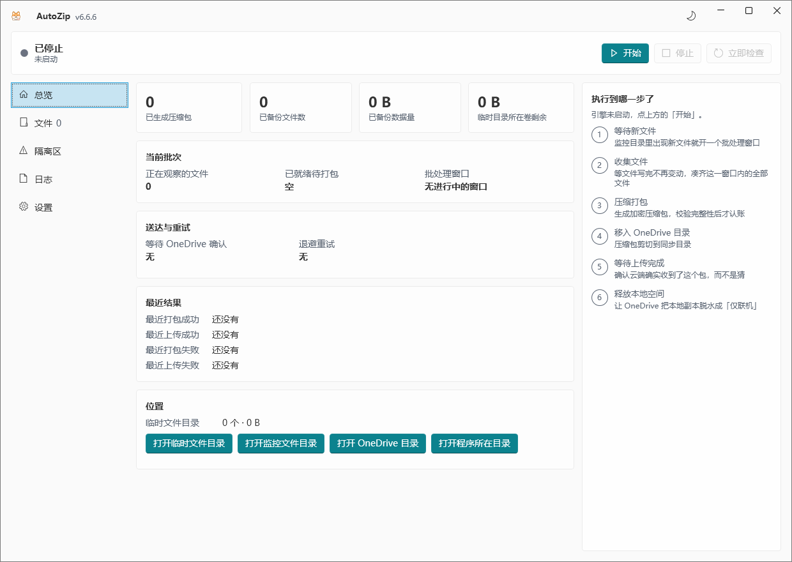

# AutoZip

自动把新增文件打成 **AES-256 加密的 `.7z`**，投递到 OneDrive 同步目录，等上传完成后**释放本地空间**，并按事件推送通知。

常驻托盘，无人值守。这是 `AutoBackupZipOneDrive`（.NET Framework 4.8 / WinForms）的完整重写版：功能与产品设计保留，架构与界面重做。



> 总览页：左边导航，中间是这一轮在干什么，右边「执行到哪一步了」把六个阶段摊开——引擎在跑时哪一步亮着一眼就能看到。深浅主题、强调色与背景图在设置页的「外观」卡片里改，选完立刻生效。

---

## 一、快速开始

### 运行

把 `publish` 文件夹整个拷到目标机，双击 `AutoZip.exe`。**不需要安装 .NET，不需要安装 7-Zip。**

文件夹里只有两样东西，缺一不可：

```
AutoZip.exe         主程序（自包含单文件，约 76 MB）
tools\7za.exe       7-Zip 控制台版（压缩引擎，必须与 exe 同级）
```

> `7za.exe` 必须是磁盘上的**真实文件** —— 它是作为独立进程被启动的，塞进单文件包里就没法运行。`publish.cmd` 每次发布后都会检查它是否存在。

### 首次配置

打开程序 → **设置** 页，至少填这三项，然后点「保存」：

| 必填 | 说明 |
|---|---|
| 监控目录 | 要备份的源目录 |
| OneDrive 目录 | 压缩包最终落点，必须在 OneDrive 的同步范围内（**同步根下的任意层子目录都可以**） |
| 压缩密码 | 空密码不允许；弱密码会被拒绝 |

保存时会做一次**完整校验**，所有问题一次性列在设置页底部的「配置检查」卡片里（而不是弹一连串对话框）。校验不通过就不能启动引擎。

配置没问题后回到 **总览** 页点「开始」。想要开机即工作，在设置里勾上「启动后自动开始监控」+「启动时最小化到托盘」。

深色 / 浅色用标题栏右侧那个太阳/月亮按钮一键切换；跟随系统、皮肤色与背景图片在设置页的「外观」卡片里。这一组**不用点保存**，选完立刻生效也立刻记住。

> 关闭窗口 = **收进托盘继续工作**。真正退出请右键托盘图标选「退出」。同一个右键菜单里的「关于」能看到版本号和数据目录 / 日志目录 / 压缩程序的真实路径；版本号也一直显示在标题栏左上角。

---

## 二、数据放在哪

**默认全部在程序自己的目录里**（exe 同级），拷走整个文件夹就是完整搬迁：

```
settings.json        配置（密码与 Webhook 用 DPAPI 加密，仅当前 Windows 用户可解）
state.json           checkpoint、待上传归档、重试计数、隔离批次
ZipTemp\             临时压缩包（可在设置里改到别处）
logs\app.log         当前日志（+ app.1.log … app.5.log，每个上限 5 MB）
tools\7za.exe        随程序携带的压缩程序
```

具体路径可以在托盘菜单的「关于」里直接看到，不用猜。

两处例外：

- **程序目录不可写时**（装进 `Program Files`、只读介质、被组策略锁住）自动退到 `%LOCALAPPDATA%\AutoZip\`，并在设置页的配置检查里**明写退让原因**。绝不静默换地方，也绝不硬写。想让数据留在程序目录，把程序移到有写权限的位置即可。放 U 盘时如果偶发探测失败，在 exe 同目录放一个空的 `portable.txt` 可以强制留在程序目录。
- **`NEWAUTOZIP_DATA=D:\SomeWhere`** —— 环境变量优先级最高，测试与自定义部署用。

启动时还会校验数据目录与 ZipTemp **不在监控目录里面**：压缩包落在被监控的目录下，会被当成新文件再打一次包，自我喂养式指数膨胀。

> 旧版也写在 exe 同目录，但没做写入探测 —— 装到 `Program Files` 下 `Checkpoint.Save` 直接抛异常，而那个异常恰好跳过了状态复位，于是演变成无限重打包。默认位置没变，变的是"写不进去时怎么办"。

---

## 三、它是怎么工作的

```
FileSystemWatcher 捕获新文件
        │
        ├─ 命中排除通配符 / 不在工作时段 → 忽略
        ↓
静默期观察：大小与修改时间连续 N 轮不变，且能以共享方式打开
        ↓                                     ├─ 文件消失 → 从跟踪列表剔除
     就绪                                     └─ 打不开 → 标记「无法读取」，继续观察
        ↓
批处理窗口：第一个就绪文件出现后再等 X 分钟，把这段时间内就绪的文件合成一个包
        ↓
打包前预检：磁盘余量够不够、ZipTemp 配额是否超限
        ↓
7za 压缩到 Backup_yyyyMMdd_HHmmss.7z.part
        ↓
校验：退出码可接受 + 文件存在 + `7za t` 完整性通过
        ↓                                     └─ 任一不通过 → 删掉 .part，退避重试
   改名为 .7z（原子提交）
        ↓
移入 OneDrive 目录
        ↓
等待上传：轮询云文件属性；勾了「释放本地空间」就请求脱水
        ↓
完成，发通知
```

### 关键：为什么不会再塞满磁盘

用户在旧版遇到的症状是「打包失败时 ZipTemp 多出很多文件，占满磁盘」。那不是一个 bug，而是六个缺陷叠加。新版的四道防线：

**1. 状态无条件复位。** 整个批次包在 `try/finally` 里，`finally` 无条件清空批次状态。任何环节抛异常——包括通知失败、状态存盘失败、磁盘已满——都不可能让下一轮重新打同一批文件。旧版的失败分支不复位，于是每个扫描周期（默认 30 秒）产出一个完整压缩包，永不停止。

**2. 原子提交。** 压缩写的是 `.7z.part`，只有三项校验全过才改名。**失败绝不留下 `.7z`**，启动时还会清扫遗留的 `.part`。

**3. 退出码分级。** `0` 成功；**`1` = 成功但有警告**（例如某个源文件被别的进程占用），记录警告并视为成功；`2`/`7`/`8`/`255` 才是失败。旧版把 `1` 当彻底失败，这是「每 30 秒产出一个完整包」最常见的触发点。同时加了 `-ssw` 允许压缩正在写入的文件，从源头降低警告概率。

**4. 退避 + 熔断。** 连续失败的间隔为 30 秒 → 1 分 → 2 分 → 5 分 → 10 分 → 30 分封顶。同一批次连续失败到设定次数（默认 6）后**进入隔离区、停止重试**，并发一条醒目通知。隔离区在界面上是一个独立页面，可以「重试」或「忽略」。

**任何批次在任何情况下都不可能无限循环。**

另外三重配额兜底（保留天数 / 最大归档数 / 最大总容量，超限按最旧优先淘汰），以及打包前的磁盘预检——预计体积 × 1.1 放不下，或卷剩余低于阈值，就**拒绝打包并告警，不产生任何文件**。

---

## 四、配置项参考

数值项的区间在 `SettingsLimits` 里定义，界面上的 `NumberBox` 与保存时的校验器**共用同一份定义**，不会出现「界面允许填但保存时报错」。

### 目录

| 项 | 默认 | 说明 |
|---|---|---|
| 监控目录 | 空 | 必填 |
| 包含子目录 | 关 | |
| OneDrive 目录 | 空 | 必填。设置页可从注册表读出的账号列表里直接选 |
| 临时压缩目录 | 程序目录下的 `ZipTemp` | 不允许放在监控目录里面 |
| 排除通配符 | `*.tmp` `*.temp` `*.part` `*.partial` `*.crdownload` `*.download` `~$*` `.~*` `*.7z` `*.lnk` | 每行一条 |

> 三个目录**互不嵌套**会被强制校验。旧版不校验：如果 OneDrive 目录在监控目录下面，生成的 `.7z` 会被当成新文件再次打包，自我喂养式指数膨胀。

### 工作时间

| 项 | 默认 | 区间 |
|---|---|---|
| 生效日期范围 | 不限 | 仅日期 |
| 全天工作 | 开 | |
| 每日时段 | 00:00 – 23:59 | **跨夜正确处理**（22:00 → 06:00 表示晚上 10 点到次日早 6 点） |
| 批处理窗口 | 5 分钟 | 1 – 1440 |

**「生效起始日期」就是文件的准入水位线**：这一天之后的文件都会被备份，**包括程序启动之前就已经躺在监控目录里的**。填下这个日期，期待的本来就是这个语义。首次运行时按下面三条规则取水位线，从最具体的开始：

1. 设了生效起始日期 → 以它为准（已有文件照样处理）；
2. 没设日期、但勾了「首次运行也处理已有文件」→ 全部处理；
3. 都没有 → 把启动这一刻记为水位线，只处理此后的新文件（默认）。

规则 1 里的水位线**不写进运行状态**，所以以后改日期立刻生效，不用去「清除运行状态」。

> 旧版把「绝对日期范围」和「每日时段」挤在两个 `DateTimePicker` 里，`MainForm_Load` 还会悄悄把每日时段设成「当前时刻 → 23:59」，而跨夜时段判断恒为假 —— 配了 22:00→06:00 就永远不工作。

### 文件监控

| 项 | 默认 | 区间 | 说明 |
|---|---|---|---|
| 静默期 | 60 秒 | 5 – 3600 | 大小与修改时间保持不变多久算写完 |
| 确认轮数 | 2 | 1 – 20 | 静默期满足后还要连续几轮不变 |
| 探测间隔 | 5 秒 | 1 – 300 | |
| 对账扫描间隔 | 300 秒 | 30 – 86400 | `FileSystemWatcher` 丢事件时的兜底全扫 |
| 首次运行处理已有文件 | 关 | | 默认只处理新增 |

判定就绪 = 大小与修改时间在静默期内不变 **且** 能以 `FileShare.ReadWrite | Delete` 打开。旧版用 `FileShare.None` **独占打开**被监控文件，有可能把正在写入的业务进程搞崩；而且需要 5 × StableSeconds = 300 秒才判定就绪，刚好撞上默认 5 分钟的窗口。

每轮还会**剔除已消失的文件**。旧版从不移除，文件被删或改名后「全部稳定」永远为假，整个程序静默假死。

### 压缩与加密

| 项 | 默认 | 区间 |
|---|---|---|
| 压缩密码 | 空 | 必填，拒绝弱密码 |
| 压缩等级 | 5 | 0（仅存储）– 9（极限） |
| 加密文件名 | 开 | `-mhe=on` |
| 归档名前缀 | `Backup` | |
| 打包超时 | 180 分钟 | 1 – 1440 |

### 磁盘与配额

| 项 | 默认 | 区间 |
|---|---|---|
| 保留天数 | 3 | **1** – 365 |
| 最大归档数 | 20 | 1 – 10000 |
| 最大总容量 | 5 GB | 64 MB – 4 TB |
| 最小剩余空间 | 10 GB | 0 – 4 TB |
| 进入隔离前的失败次数 | 6 | 1 – 100 |

> 保留天数最小值是 1，不是 0。旧版允许填 0，而 0 会让清理逻辑直接 `return` —— 等于永久关闭清理。

### OneDrive 上传

| 项 | 默认 | 区间 |
|---|---|---|
| 释放本地空间 | 开 | 上传完成后脱水为「仅联机」 |
| 上传超时 | 120 分钟 | 1 – 1440 |
| 轮询间隔 | 15 秒 | 2 – 600 |

**OneDrive 目录可以是同步根下面任意深度的子目录**，比如 `D:\onedrive\OneDrive - 默认目录\AutoZip_Bak`。判定走的是 Cloud Files 的同步根标记（`CF_PLACEHOLDER_STATE_SYNC_ROOT`）——从目标目录逐层向上找同步根，找到就算在范围内。这比「路径里有 OneDrive 字样」可靠得多：谁都能建一个叫 OneDrive 的普通文件夹，那里面的东西永远不会被上传。

真的不在同步范围内时（OneDrive 没登录、目录在同步范围之外）会明确提示，压缩包仍会移进去，但程序**不会谎报上传成功**，也不会释放本地空间。

### 通知

渠道从下拉框**显式选择**：无 / 企业微信 / 钉钉 / Telegram / 通用 Webhook。企业微信、钉钉、通用 Webhook 填 Webhook 地址；Telegram 填 Bot Token + Chat ID。设置页有「测试发送」按钮，结果就地显示。

可订阅事件（设置页 12 个勾选项，照时间线排）：**【启动】【开工】【第 N 次发现新文件】【就绪】【打包】【上传】【结束】【收工】【失败】【隔离】【磁盘】【停止】**。旧版只在「开始 / 打包成功 / 上传成功 / 结束」发通知——**打包失败恰恰不发**，最需要告警的场景反而静默。

**所有事件统一用同一种三段式正文**——时间 + 方括号标签 + 内容。时间**带年月日**：通知是发到手机和聊天窗口里的，晚上翻到只剩「08:12:33」根本分不清是今天早上还是昨天早上。

```
2026-08-24 18:02:07
【第 1 次发现新文件】
OneDrive：客户端运行正常。
检测到有新文件，已进入自动化处理流程…
发现新文件：1. MT20210608_20260824_180100.bak（4.72G），持续观察中......
稳定判定：静默 60 秒且连续 2 次大小不变。
全部稳定后，等批处理窗口（5 分钟）到期即开始打包。

2026-08-24 18:10:47
【打包】
本次共 1 个文件打包成功。
源文件总大小：4.72G
文件列表：
1. MT20210608_20260824_180100.bak（4.72G）
压缩包：Backup_20260824_180907.7z
压缩包大小：4.27G（90.5%）
打包耗时：0小时08分40秒
准备开始上传至OneDrive。

2026-08-24 18:20:53
【结束】
OneDrive：✔ 本次上传文件和释放空间成功完成（仅联机）。
本次自动化处理已结束。
压缩包：Backup_20260824_180907.7z
压缩包大小：4.27G
包含文件：1 个
上传耗时：0小时09分46秒
共计耗时：0小时18分46秒
源文件总大小：4.72G → 压缩包 4.27G
程序所在磁盘 D:：总 465.7G，可用 128.4G
下一次的工作开始时间：全天监控，一发现新文件就立刻开始下一轮。
```

**【第 N 次发现新文件】的两个编号是两回事**：标签里的 N 数的是「本轮第几条这种通知」，一条 +1——同一时刻进来 2 个文件也只发一条，所以【第 3 次】之后是【第 4 次】而不是【第 5 次】；正文里的 `1. 2. 3.` 则**每条通知各自从 1 数**，只列这一条带来的文件。观察期里文件从 0B 长到 9.85K 是正常写入过程，不再为此重发通知（同一个文件一轮只通报一次），全部稳定之后由【就绪】一次说清。

源文件在打包前**全部消失**时，本轮以**【取消】**收尾：正文列出消失的文件、说明什么都没产出。它跟【结束】共用一个开关和同一个枚举位（`RoundFinished`），但用词必须不同——正文里一个压缩包都没有，标签得让人一眼看出这一轮是空手收场。这一支曾经一条通知都不发，而【就绪】里已经许诺了「打包开始时间」，用户等到那个时刻却再也收不到消息。

【打包】的文件列表最多列 20 条，超出的写成「… 另有 N 个文件未列出」——企业微信正文有 4096 字节上限，一个几百文件的批次会把正文整段截掉，连后面的「压缩包大小」都看不见。

「共计耗时」是从**第 1 次发现新文件**算到上传确认完成，跨越打包与上传两段，所以它跟着状态一起活过重启。

企业微信 / 钉钉 / Telegram 收到的是上面这段渲染好的文本。**通用 Webhook 发的是结构化 JSON**，下游可以按字段分流而不必去正则匹配中文：

```json
{
  "source": "AutoZip",
  "event": "PackCompleted",         // 不变的英文枚举名，用来分流
  "severity": "info",               // info / warning / error
  "tag": "打包",
  "time": "2026-08-24 18:10:47",
  "title": "【打包】",
  "body": "本次共 1 个文件打包成功。\n…",
  "text": "2026-08-24 18:10:47\n【打包】\n本次共 1 个文件打包成功。\n…",   // 想直接转发就取这个
  "machine": "WORKSTATION-01",
  "timestamp_utc": "2026-08-24T10:10:47.1234567+00:00"        // 带时区偏移的 ISO-8601
}
```

分流按 `event` 走、别去猜 `tag`：`tag` 是给人看的中文词，同一个 `event` 可以有两个词（`RoundFinished` → 「结束」或「取消」）。

> 旧版靠 `hook.Contains("weixin")` 猜渠道，而 `WeComWebhookNotifier.IsEnabled` 的前缀校验与之不一致 —— 界面显示「✔ 企业微信群」但通知被静默丢弃。而且旧版**打包失败根本不发通知**，最需要告警的场景反而静默；JSON 也是手拼字符串手写转义，文件名里一个引号就能把整个请求体弄坏。

### 界面与运行

| 项 | 默认 | 说明 |
|---|---|---|
| 启动时最小化到托盘 | 关 | 开机自启时建议打开 |
| 程序启动后自动开始备份 | 关 | 不用每次手点「开始」 |
| 日志级别 | 普通 | 调试 / 普通 / 警告 / 错误。只影响输出详细程度，不影响备份行为 |

版本号就显示在标题栏左上角，取自程序集版本而不是界面上手抄的常量 —— 手抄的迟早和真实版本对不上，而报问题时第一句要问的就是版本。

托盘图标右键有「关于」：版本、一句话说明、以及**数据目录 / 日志目录 / 压缩程序**三处真实路径。出问题时要问的就是这三个，摆在那里就不必再教人去翻。关闭窗口只是收进托盘，备份继续跑；真正退出要在同一个菜单里选「退出」。

### 主题与皮肤（设置页里叫「外观」）

| 项 | 默认 | 说明 |
|---|---|---|
| 主题 | 跟随系统 | 跟随系统 / 浅色 / 深色 |
| 皮肤色 | 跟随系统强调色 | 8 个预置色块，或手填 `#RRGGBB`。只改按钮、勾选框、进度条这类控件的高亮色 |
| 背景图片 | 无 | 任选一张本机图片铺满窗口；留空则保持 Windows 的 Mica 材质 |
| 模糊 | 18 | 0 – 60。滑块，边拖边看 |
| 不透明度 | 30% | 5% – 100%。没选图时这两条滑块是禁用的 |

设置页这一节叫「外观」而不再叫「主题与皮肤」——「皮肤」在中文里既能指强调色也能指整张背景图，两个东西并排放在一个含糊的标题下，用户拖了半天颜色也换不掉背景。现在标题按它真正管的三件事写：主题模式 / 强调色 / 背景图片。

背景图找不到（被删了或改了名）时不会静默变白：界面就地说明原因并回到 Mica，配置也不会因为一个坏路径起不来。

标题栏右侧有个一键深浅切换（太阳 / 月亮图标），设置页是完整入口（含「跟随系统」与皮肤色）。两边改的是同一个值，会互相同步。

**这一组是唯一不用点「保存配置」的设置：选完立刻生效，也立刻记住。** 挑颜色看不见效果等于这功能没有；看见了又要求用户记得去点保存同样说不通。落盘走的是单独一条路径（只改主题与皮肤两个字段，从磁盘上的现值克隆），所以设置页上没提交的其他编辑**不会**被顺手写进去。

「跟随系统」读的是 `HKCU\...\Themes\Personalize` 里的 `AppsUseLightTheme`，并在用户中途改系统设置时实时跟随；固定成浅色或深色后监听会撤掉，系统再变也不会推翻你的选择。

皮肤色容错：接受 `#RGB` / `RGB` / `#RRGGBB` / `RRGGBB`，忽略大小写与首尾空白，统一规范成大写六位。带 Alpha 的 8 位**不收**（强调色是不透明色，半透明值只会让界面莫名发灰）。填错时界面就地提示并沿用上一个有效色，绝不因为一个坏值就起不来。

> 语义色（状态圆点、次要文字、日志级别色）在两套主题下各配了一份，都按正文 4.5:1 的对比度挑过。直接把深色值端到白底上是不能用的 —— `MutedText #A6AEBB`、`LogInfo #D6DBE0` 这种浅灰在白底上基本看不见。

---

## 五、遇到问题怎么查

日志在 `%LOCALAPPDATA%\AutoZip\logs\app.log`，界面 **日志** 页也能看（可切换级别、可复制、可直接打开日志文件）。**密码在任何输出里都会被脱敏**。

| 现象 | 检查 |
|---|---|
| 点「开始」后立刻停下 | 设置页底部的「配置检查」卡片，里面列了全部问题 |
| 提示找不到压缩程序 | `tools\7za.exe` 是否与 exe 同级 |
| 文件一直停在「观察中」 | 是否仍在被写入；静默期与确认轮数是否设得过长 |
| 文件标着「无法读取」 | 被别的进程独占了。打包时会跳过并记录警告 |
| 批次进了隔离区 | 隔离区页面有失败原因。修掉原因后点「重试」 |
| 上传一直等不到确认 | 卷是否支持 Cloud Files、OneDrive 是否登录且正在同步。超时后会**如实报告**「已移入 OneDrive 目录，但未能确认上传完成」，不会谎报成功 |
| 界面显示运行中但什么都不做 | 检查工作时段（尤其跨夜配置）与生效日期范围 |

程序已经在运行时再次双击 exe，会唤起已有窗口而不是开第二个实例（互斥锁按数据目录派生：同一用户的多个会话会被拦住，不同用户各自的 `%LOCALAPPDATA%` 可以同时运行）。

---

## 六、从源码构建

需要 **.NET 8 SDK (x64)**，不需要 Visual Studio。

```bash
build.cmd
```

Debug 构建 + 367 个单元测试。`build.cmd release` 用 Release，`build.cmd selftest` 额外跑一遍界面自检。

```bash
publish.cmd
```

四步：单元测试 → 清理 → 自包含单文件发布 → **在发布产物上跑界面自检**。任一步失败就中止，不会产出半成品。产出在 `publish\`。

### 发布一个版本

```bash
release.bat
```

全中文交互。它会先判断这一把是**首次提交**还是**常规发版**，两条路走的东西不一样（见下）。常规发版的流程：

1. 跑一遍完整的本地关卡（`publish.cmd`：单元测试 → 单文件发布 → 在发布产物上跑界面自检）；
2. 把版本号写进 `Directory.Build.props` 的 `Version` / `AssemblyVersion` / `FileVersion` 三处；
3. 提交 —— **提交说明一律由你手动输入，脚本不代写**；
4. 打 tag `vX.Y.Z`、推分支和 tag；
5. GitHub Actions 接手：从 tag 重新编译，打成 `AutoZip-X.Y.Z-win-x64.zip`（里面是 `AutoZip.exe` + `tools\7za.exe`），建好 Release。

**本机不需要装 GitHub CLI，也不需要往网页上手工拖那个 70 多 MB 的包。** 唯一需要登录的地方是第一次 `git push`：Git for Windows 自带的凭据管理器会开一个浏览器窗口让你登录 GitHub，登一次就记在 Windows 凭据管理器里。

版本号只在 `Directory.Build.props` 里写一次。标题栏左上角的 `v6.6.7` 和「关于」窗口里的 `AutoZip 6.6.7` 都是运行时读程序集版本得来的，别处没有抄第二份 —— 抄出来的迟早和真实版本对不上，而报问题时第一句要问的就是版本号。

| 用法 | 干什么 |
|---|---|
| `release.bat 6.6.7` | 版本号直接给在命令行上，不再问 |
| `release.bat 6.6.7 -DryRun` | 只说会做什么，一个字节都不改。**第一次用先跑这个** |
| `release.bat 6.6.7 -NoSelfTest` | 本地关卡里跳过界面自检，快一些 |
| `release.bat 6.6.7 -NoGate` | 本机完全不编译直接推 —— CI 那边照样跑测试 |
| `release.bat -ShowGitOutput` | 把 git 的原始输出也打出来（排错用） |
| 版本号留空 | 不改版本号，按 `Directory.Build.props` 现在的值发一版 |

老式的裸词参数（`dryrun` / `noselftest` / `nogate`）仍然认，不用改习惯。

工作树不干净时它会先把改动列出来，问你要不要一并塞进这次 release 提交（默认不要：release 提交里最好只有版本号那一行，历史才说得清什么时候发了什么）。

推上去之后在 <https://github.com/ovoene/AutoZip/actions> 看进度，几分钟出结果。

#### 提交说明为什么必须手写

脚本只给你一个参考写法，**直接回车不会通过**。空输入会一直问下去，超过 120 个字符也会被打回来（先写一句，细节放「补充说明」，那段可以留空）。

半年的提交历史里唯一能解释「这次为什么发」的就是这行字，脚本代写出来的东西等于没写。

#### 首次提交

脚本会自己认出三种状态，不需要你告诉它：

| 状态 | 判定依据 | 走哪条路 |
|---|---|---|
| 这个目录还不是 git 仓库 | `git rev-parse --is-inside-work-tree` 失败 | 首次提交：先问要不要 `git init`，还会问初始分支名（默认 `main`） |
| 是仓库，但一个提交都没有 | `git rev-parse --verify HEAD` 失败 | 首次提交：跳过初始化，其余照走 |
| HEAD 存在 | 上面两个都成功 | 常规发版 |

第二条同时覆盖了 `git checkout --orphan` 建出来的空分支 —— 那种情况下仓库里明明有历史，但当前分支是空的，判定必须看「当前分支有没有提交」而不是「仓库有没有提交」。

首次提交比常规发版多四件事，这是四种东西在第一次提交时绕不过去：

1. **提交人身份**。没配 `user.name` / `user.email` 时 git 会直接拒绝提交，而且报的是一串英文。脚本先问你要名字和邮箱，写进仓库的本地配置里。已经配过的会先把值显示出来让你确认。
2. **`.gitignore`**。没有它，`bin/` `obj/` `publish/` 这几个几百兆的目录会一起进第一次提交，而进了历史就再也清不干净。脚本检测到没有就帮你生成一份，并且会预览暂存清单、把落在 `bin/` `obj/` `publish/` 下面的文件单独点出来让你确认。
3. **远端 origin**。没有就问你要不要加（默认填 `https://github.com/ovoene/AutoZip.git`，可以改）。选择不加就只提交到本地，不推送。
4. **标签可选**。常规发版一定会打 `vX.Y.Z`，首次提交则由你选 —— 打了才会触发 CI 建 Release，不打就只是把代码推上去。这个因果脚本会明说。

> 旧脚本在这一步是走不通的。它靠 `git rev-parse --abbrev-ref HEAD` 拿分支名，而未出生的分支上这条命令返回的是 `HEAD` 四个字母（还附带一句 `fatal:`），于是被当成「不在 main 上」反复询问；紧接着 `git diff-index --quiet HEAD` 也必然失败，于是所有文件都被当成「未提交的改动」问你要不要折叠进 release 提交 —— 而首次提交时它们本来就是全部内容，这个提示毫无意义。现在分支名改由 `git symbolic-ref --short -q HEAD` 拿，它在未出生的分支上照样给出真正的分支名。

首次提交默认也会跑一遍本地关卡：第一次推上去的东西如果测试都过不了，CI 上那条红色记录会一直挂着。嫌慢就加 `-NoGate`。

### CI 上为什么不跑界面自检

`.github\workflows\release.yml` 调的是 `publish.cmd noselftest`，跑的和本机是**同一个脚本** —— 不在 yml 里另抄一份 `dotnet publish` 参数，抄出来的两份迟早各走各的。唯一的差别是跳过界面自检：那个自检量的是**真实渲染出来的颜色和布局**，在一台没有真实桌面、没有 Mica、分辨率固定的 CI 机器上，它的结论价值低于它带来的抖动。所以自检留在本机 —— `release.bat` 打 tag 之前必须先过一遍，没过就没有 tag，也就没有 Release。

工作流里另有一道闸：**tag 说的版本号和 `Directory.Build.props` 里的对不上就直接失败**。否则会发出一个「Release 页面写着 6.6.7、程序标题栏写着 6.6.6」的包，而这种版本号错位是最难查的一类问题 —— 用户报上来的那个版本根本不存在。

想不打 tag 先演练一遍工作流：Actions 页面上选 release → **Run workflow**。一样编译打包，产物存成 workflow artifact，不建 Release、不碰 tag。

### 界面自检是什么

XAML 绑定写错**不会导致编译失败** —— 运行时才在调试输出里冒一条警告，界面上就是一块空白。`AutoZip.exe --selftest` 关掉这个漏洞：

在屏幕外构造主窗口，遍历全部 5 个页面、注入样例数据再遍历一遍、逐个切换设置页的所有渠道与压缩等级，同时挂上 WPF 的绑定/资源/标记诊断源。捕获到任何绑定错误就以退出码 1 结束，并把完整报告写进 `selftest-report.txt`。

主题也在自检范围内，**四种组合（浅色/深色 × 系统强调色/自定义皮肤）各把五个页面重新布局一遍**。只在深色下测等于只测了一半：「浅灰字落在白底上」这种问题编译期看不出来、深色下也看不出来。另外会核对语义配色的两层 —— 每个键的 `*Color` 资源存在且是 `Color`、画刷存在且是 `SolidColorBrush` 且**没有被 Freeze**。这三件事任一不成立，切主题时那个颜色就会静静地停在上一个主题的值上，不报错、不崩，只是白底上出现一行看不见的字。

它不抢单实例锁，所以程序正常运行时也能随时跑。

### 目录结构

```
NewAutoZip.sln
Directory.Build.props                 统一 Nullable / TreatWarningsAsErrors / 版本号
build.cmd  /  publish.cmd             本地构建 / 发布
release.bat                           发版入口（启动器，GBK）
release.ps1                           发版逻辑本体，全中文交互
.github\workflows\release.yml         推上 v* tag 就自动编译打包建 Release
src\NewAutoZip.Core\                  net8.0-windows，零 UI 依赖，可单元测试
  Configuration\  Scheduling\  Watching\  Packing\  Storage\
  OneDrive\  Notifications\  Pipeline\  Diagnostics\
src\NewAutoZip.App\                   net8.0-windows + WPF + WPF-UI 4.3.0
  Views\  ViewModels\  Services\  Themes\  tools\7za.exe
tests\NewAutoZip.Tests\               xunit，用 FakeTimeProvider 做确定性时间
```

核心层不引用任何 UI 程序集 —— 这是旧版最缺的东西，也是能写单元测试的前提。所有业务逻辑都在 Core 里，界面只做三件事：把配置读给引擎、把引擎快照画出来、把用户点击转成引擎调用。

### 改 `release.bat` / `release.ps1` 时注意编码

cmd.exe 用**控制台代码页**（本机 936）解码批处理文件，不是 UTF-8。一行 UTF-8 中文的字节数若让末尾落成一个不成对的 GBK 前导字节，就会把行尾的 `CR` 一起吞掉，把下一条命令粘到注释上 —— 而且是否发生取决于每行的字节奇偶，所以单行能过、组合起来就崩。加 `chcp 65001` 只会更糟（cmd 改代码页后会丢失文件读取偏移，从上一行中间重新执行）。

发版脚本要全中文提示，又不能掉进这个坑，所以拆成了两个文件：

| 文件 | 编码 | 为什么 |
|---|---|---|
| `release.ps1` | **UTF-8 带 BOM** | 逻辑与全部中文提示都在这里。PowerShell 读带 BOM 的 UTF-8 是妥当的；**不带 BOM 时 Windows PowerShell 5.1 会按本地代码页解，中文直接变乱码。** |
| `release.bat` | **GBK（代码页 936）** | 只剩一个启动器，负责挑 PowerShell 把 `release.ps1` 跑起来并传回退出码。GBK 的后继字节范围是 `0x40-0x7E` 与 `0x80-0xFE`，永远不可能是 `0x0D`（回车）或 `0x0A`（换行），所以**中文注释不会吞掉行尾的回车**；即便有人用 UTF-8 去解这些字节，`0x0D` 也不是 UTF-8 的后续字节，照样安全。 |
| `build.cmd` / `publish.cmd` | 纯 ASCII | 注释用英文，理由同上。这两个文件由 CI 直接执行，不值得为注释引入编码风险。 |

**别把 `release.bat` 另存成 UTF-8**，那会破坏上面那条保证。编辑器里如果看到它的中文变成乱码，八成就是被转过码了 —— 这时按 GBK 重新载入即可，不要直接保存。

脚本运行时会把控制台输出编码显式设成 UTF-8（这样中文提示在非中文 Windows 上也对），但在调用 `publish.cmd` 之前**一定会先还原**，跑完再改回来：cmd.exe 在代码页 65001 下处理批处理文件有过丢文件读偏移的毛病，而 `publish.cmd` 里既有 `goto` 又有多行括号块，中招了就会诡异失败。脚本退出时也会还原，不会把你的命令行留在 65001 上。

`.github\workflows\release.yml` 不受这些限制：yml 由 GitHub 按 UTF-8 读，注释照常写中文。

---

## 七、已知限制（如实交代）

- **7-Zip 命令行密码**：7-Zip CLI 无法从 stdin 或文件读密码，`-p` 参数仍会短暂出现在进程命令行上，同机的其他进程理论上可以看到。彻底消除需要 P/Invoke 调 `7z.dll` 让密码只留在进程内，但会引入原生 DLL 依赖 —— 默认不采用。文件清单本身走 `@listfile`（UTF-8 + `-scsUTF-8`），所以不受命令行 32K 上限限制。
- **DPAPI 作用域**：`settings.json` 里的密码与 Webhook 用当前 Windows 用户的 DPAPI 加密。**换用户或重装系统后解不开**，需要重新填写。这是刻意选择——比明文存放安全得多。
- **上传确认依赖 Cloud Files**：判定上传完成的依据是 OneDrive 的云文件属性（`FILE_ATTRIBUTE_RECALL_ON_DATA_ACCESS` + `GetCompressedFileSizeW`）。原理是 **OneDrive 不会脱水一个尚未上传完成的文件，所以「脱水成功」本身就是「上传完成」的证明**。若卷不支持 Cloud Files，或用户在 OneDrive 里把该目录设为「始终保留在此设备上」，就无法确认——此时会在超时后如实报告，不会谎报成功。这条路径**不依赖系统语言**（旧版靠 Shell COM 匹配中文列名「可用性状态」，英文系统上全部失效 → 死等 2 小时 → 误报超时且永不释放空间）。
- **上传等待跨重启可恢复**：待上传归档记录在 `state.json` 里，重启后继续等待原归档，而不是重新打包。

---

## 八、旧版对照

`F:\Google\AutoBackupZipOneDrive_net48` 原封不动保留作为参照。主要差异：

| | 旧版 | 新版 |
|---|---|---|
| 框架 | .NET Framework 4.8 / WinForms | .NET 8 / WPF（Fluent） |
| 停止 | `bool` 标志，打断不了最长 2 小时的 `Thread.Sleep`；`StopProgram` 丢掉线程引用 → 再点开始会起第二个 Worker | `CancellationToken` 全链路，杀进程树、取消 HTTP；`StopAsync` 等真正退出后才解锁 UI |
| 多开 | 可以随便开好几个，同时往 ZipTemp 扔包、同时写 checkpoint | 命名互斥锁禁止多开，第二次启动唤起已有窗口 |
| 监控 | 每 30 秒全目录 `GetFiles` 轮询 | `FileSystemWatcher` + 防抖，定时对账兜底 |
| 打包子进程 | 重定向 stdout 却从不读取 → 写满管道即阻塞，主线程死等 stderr → **死锁**，`WaitForExit()` 无超时 | 异步双流 + `WaitForExitAsync(ct)` + 总时限，`-bsp1` 解析真实进度 |
| 失败处理 | 不复位状态 → 无限重打包；打包失败不发通知 | `try/finally` 无条件复位 + 退避 + 熔断隔离 + 失败通知 |
| 配额 | 只有保留天数，且填 0 等于关闭 | 天数 + 数量 + 总容量三重，加打包前磁盘预检 |
| 密码 | 明文写进 `backup_zip.log`，与压缩包同机存放 | DPAPI 加密存储，全部输出脱敏 |
| 数值输入 | 四个控件全是 WinForms 默认 0–100；扫描间隔填 0 → 100% CPU 忙等 | 每个 `NumberBox` 都有真实区间，与校验器共用定义 |
| 日志 | 界面只留 12 行，每文件每轮推一条「写入中」，20 个文件就刷爆 | 虚拟化列表 2000 行 + 轮转文件日志，可按级别过滤 |
| 编码 | 三个源文件是 GB2312，注释已乱码成 `����ʧ��` | 全部 UTF-8 |
| 主题 | 只有系统默认的灰色 WinForms 外观 | 深色 / 浅色 / 跟随系统 + 8 个预置皮肤色或自填，即时生效即时保存 |
| 测试 | 无 | 367 个单元测试 + 界面自检（含四种主题组合） |
